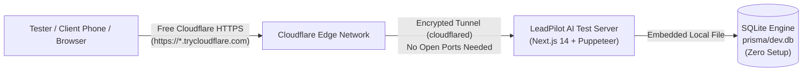

# Test & Staging Deployment Guide (Cloudflare + SQLite)
> **Lightweight Zero-Postgres Setup for Rapid Cloud Testing & Demos**

---

## 1. Overview & Purpose

This guide is designed for **testing, reviewing, and staging LeadPilot AI through Cloudflare without configuring or running a PostgreSQL database**.

### Key Highlights of the Test Setup
- ⚡ **Zero PostgreSQL Required**: Uses the embedded **SQLite** engine (`prisma/dev.db`) already pre-seeded with test data.
- 🌐 **Free Cloudflare Quick Tunnel (TryCloudflare)**: Exposes the test environment via Cloudflare's global edge network with **free HTTPS** without needing a registered domain or Cloudflare login.
- 🚀 **100% Functionality Preserved**:
  - Full Next.js 14 Web UI & CRM Dashboard
  - Interactive Swagger API Documentation (`/docs` and `/api-docs`)
  - Tamil Nadu Government Automation Engine (TNREGINET 30-Year EC, Patta/Chitta, FMB Boundary Vectors)
  - Multi-tenant Auth & Role-Based Access Control



---

## 2. Automated Deployment on Code Commit (1-Command Setup)

You can configure LeadPilot AI to **automatically build, run test validation, and deploy to your Cloudflare Dev environment whenever you commit code**.

### Option 1: Automatic Local Git Hook (Every `git commit`)
Run this single command to install the automatic post-commit deployment hook:
```bash
npm run setup:hook
```
Once installed, whenever you run:
```bash
git add .
git commit -m "feat: your new feature"
```
Git will **automatically trigger**:
1. Full Vitest test suite execution (`npm test -- --run`) to ensure zero broken code.
2. Prisma Client re-generation.
3. Dev Docker stack rebuild & launch with SQLite and Cloudflare Tunnel (`docker-compose.test.yml`).
4. Prints the live Cloudflare public URL directly in your terminal.

---

### Option 2: Manual Trigger via NPM
Whenever you want to trigger the deployment manually:
```bash
npm run deploy:dev
```
*Or on Windows PowerShell*:
```powershell
.\scripts\deploy-dev.ps1
```
*Or on Linux/macOS*:
```bash
./scripts/deploy-dev.sh
```

---

### Option 3: Automated CI/CD on Git Push (GitHub Actions)
We have included a pre-configured GitHub Actions workflow in [`.github/workflows/deploy-dev.yml`](file:///.github/workflows/deploy-dev.yml).
- Automatically runs whenever you push commits to `dev`, `develop`, or `main`.
- Validates the test suite, builds Next.js, and creates the dev container.

---

## 3. Option A: Fastest 1-Minute Local Test (No Docker Required)

If you already have Node.js installed on your machine, you can run the test version and expose it through Cloudflare in 2 commands:

### Step 1: Start the Local Test Server
Make sure `.env` points to SQLite (this is the default):
```ini
DATABASE_URL="file:./dev.db"
AUTH_SECRET="test-secret-key-at-least-32-characters-long"
NEXT_PUBLIC_APP_URL="http://localhost:3000"
AI_PROVIDER="MOCK"   # Set to "GEMINI" and provide GEMINI_API_KEY for live OCR
```

Start the application:
```bash
# In Terminal 1:
npm run dev
```
The app will run locally at `http://localhost:3000`.

---

### Step 2: Expose via Cloudflare Quick Tunnel

Open a second terminal to generate a secure Cloudflare public URL:

#### On Windows (PowerShell):
Install and run `cloudflared`:
```powershell
# 1. Install cloudflared via Windows Package Manager (one-time)
winget install --id Cloudflare.cloudflared -e

# 2. Launch the instant Cloudflare Quick Tunnel:
cloudflared tunnel --url http://localhost:3000
```

#### On macOS / Linux:
```bash
# macOS: brew install cloudflared
# Linux: curl -L --output cloudflared.deb https://github.com/cloudflare/cloudflared/releases/latest/download/cloudflared-linux-amd64.deb && sudo dpkg -i cloudflared.deb

cloudflared tunnel --url http://localhost:3000
```

#### Using Docker (if you prefer not to install cloudflared locally):
```bash
docker run --rm -it --network=host cloudflare/cloudflared:latest tunnel --url http://localhost:3000
```

---

### Step 3: Get Your Free Cloudflare Public URL
In the `cloudflared` terminal output, you will see a public HTTPS URL generated by Cloudflare:
```text
+--------------------------------------------------------------------------------------------+
|  Your quick Tunnel has been created! Visit it at:                                          |
|  https://crystal-forest-random-words.trycloudflare.com                                     |
+--------------------------------------------------------------------------------------------+
```

You can now open this link on **any browser, smartphone, or share it with external team members** to test the live application!

---

## 3. Option B: 1-Command Dockerized Test Stack (`docker-compose.test.yml`)

If you prefer testing with Docker on a server or staging VM without installing Node or Postgres:

### Step 1: Run the Pre-Configured Test Compose
We have provided a dedicated [`docker-compose.test.yml`](file:///C:/leadpilot-ai/docker-compose.test.yml) file:

```bash
docker compose -f docker-compose.test.yml up -d --build
```

This starts:
1. **`leadpilot-test`**: Next.js 14 container with pre-installed headless Chromium for TNREGINET automation and mounted SQLite database.
2. **`leadpilot-test-tunnel`**: Automated Cloudflare Quick Tunnel container.

---

### Step 2: Retrieve Your Live Cloudflare URL
Run this command to inspect the tunnel logs and grab your URL:
```bash
docker compose -f docker-compose.test.yml logs cloudflared-test
```
You will see:
```text
INF +--------------------------------------------------------------------------------------------+
INF |  Your quick Tunnel has been created! Visit it at:                                          |
INF |  https://alpha-beta-gamma.trycloudflare.com                                                |
INF +--------------------------------------------------------------------------------------------+
```

---

### Step 3: Stopping the Test Stack
When you are done testing:
```bash
docker compose -f docker-compose.test.yml down
```
*(All your database test records in `prisma/dev.db` and generated PDFs remain saved on disk).*

---

## 4. Option C: Test on Cloudflare with Your Own Custom Subdomain (e.g. `test.yourdomain.com`)

If you want the test instance to point to your own domain in Cloudflare rather than a temporary `.trycloudflare.com` link:

1. Go to [Cloudflare Zero Trust](https://one.dash.cloudflare.com/) $\rightarrow$ **Networks** $\rightarrow$ **Tunnels** $\rightarrow$ **Add a Tunnel**.
2. Name it: `leadpilot-test-tunnel`.
3. In the **Public Hostname** tab:
   - **Subdomain**: `test` (or `demo`)
   - **Domain**: `yourdomain.com`
   - **Service Type**: `HTTP`
   - **URL**: `localhost:3000` (or `leadpilot-test-app:3000` if using Docker)
4. Run your tunnel with your token:
   ```bash
   cloudflared tunnel run --token YOUR_TEST_TUNNEL_TOKEN
   ```
   Or in `docker-compose.test.yml`:
   ```yaml
   command: tunnel run --token YOUR_TEST_TUNNEL_TOKEN
   ```

---

## 5. Pre-Seeded Test Credentials & Quick Smoke Test

### Test User Login
| Role | Email | Password |
| :--- | :--- | :--- |
| **Super Admin / Legal Manager** | `admin@leadpilot.internal` | `AdminPassword123!` |

---

### Government Land Records Test Scenarios
To verify the live Tamil Nadu automation engine on the test deployment:

#### Test Scenario 1: Subdivision 1B1B (Schedule 2 Output)
- **District**: `Namakkal`
- **Taluk / SRO**: `Mallasamuthiram`
- **Village**: `Mallasamudram Kilmugam`
- **Survey Number**: `322`
- **Subdivision Number**: `1B1B`
- **Expected Verification**:
  - Generates official 22-entry TNREGINET EC.
  - Entry 22 shows **Schedule 2 Details**, **`3270.0 SQUARE FEET`**, Market Value **`Rs. 4,38,456/-`**, Survey No **`322/1B1B`**, and combined extent remark of `5886 sq.ft`.

#### Test Scenario 2: Subdivision 1B1A (Schedule 1 Output)
- Same survey `322`, Subdivision: `1B1A`.
- **Expected Verification**:
  - Entry 22 shows **Schedule 1 Details**, **`2616.0 SQUARE FEET`**, Market Value **`Rs. 3,50,544/-`**, Survey No **`322/1B1A`**.

---

### Testing Interactive Swagger Documentation
Open the following route in your Cloudflare test link:
```text
https://<your-cloudflare-test-url>/docs
```
- Click **"Get & Copy Test Token"** in the top bar.
- Click **Authorize** 🔓 $\rightarrow$ Paste token.
- Test endpoints directly:
  - `GET /api/govt/tn/jurisdiction?action=zones`
  - `GET /api/properties`
  - `POST /api/properties/{id}/legal/fetch-govt-docs`
  - `DELETE /api/properties/{id}/documents` (Reject bad document)

---

## 6. Comparison: Test Setup vs. Production Setup

| Feature | Test Version ([`DEPLOYMENT_TEST_CLOUDFLARE_ENV.md`](file:///C:/leadpilot-ai/DEPLOYMENT_TEST_CLOUDFLARE_ENV.md)) | Production Version ([`DEPLOYMENT_CLOUDFLARE_ENV.md`](file:///C:/leadpilot-ai/DEPLOYMENT_CLOUDFLARE_ENV.md)) |
| :--- | :--- | :--- |
| **Database** | **SQLite (`prisma/dev.db`)** | **PostgreSQL 16** (Docker / Managed RDS / Neon) |
| **Database Setup** | Zero setup (Embedded file) | Requires DB container or cloud connection string |
| **Cloudflare Ingress** | **Quick Tunnel (`*.trycloudflare.com`)** | Named Zero Trust Tunnel (`yourdomain.com`) |
| **Account Required** | **None** (Instant anonymous tunnel) | Cloudflare Account + Registered Domain |
| **Cost** | **100% Free** | Free Cloudflare Tier + Server Hosting |
| **Best For** | Demos, client previews, QA testing, feature checks | Live multi-tenant SaaS production traffic |

---

*LeadPilot AI — Zero-PostgreSQL Test & Staging Guide with Cloudflare Quick Tunnels.*

